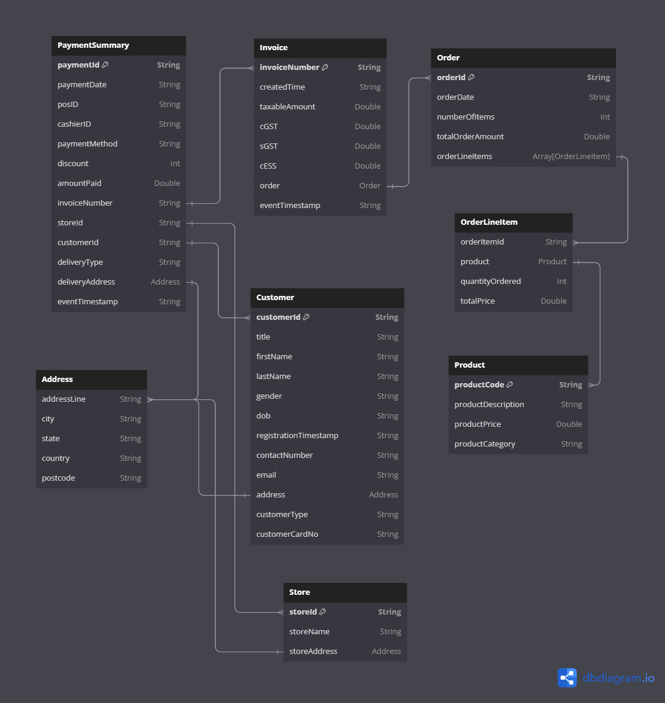
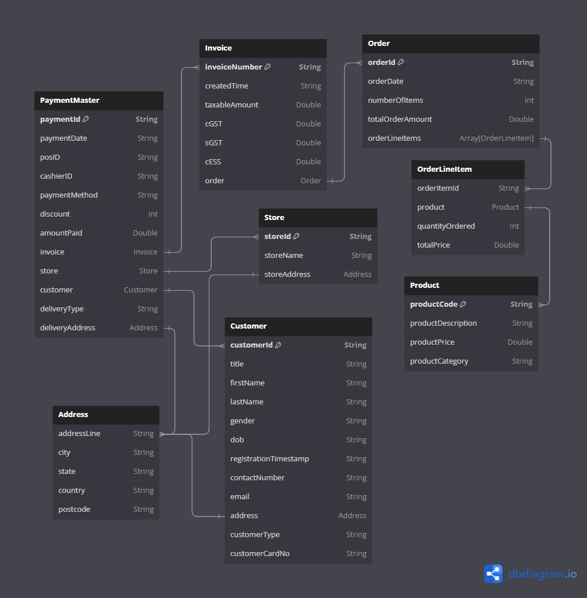

## Application Summary
This dateset is used for doing use-cases like learning spark-sql and spark structured streaming where you need some 
data in files while some part of data in kafka. Also, we want to perform joins between different datasets/kafka stream

**About the Data**
- One can generate either Invoices, Payments(Summary) or Payment-Master(Master Data)
- In all cases, Customers, products and stores data are implicitly generated and always written to file.
- Customer data is written in avro file format
- Stores and Product Datasets are written to file in json format.
- In case you want to perform joins with customer, store or product, these files can be used.

You can configure(config/data_generator.conf) and run the application for any of the below dataset. 
The data will be written to kafka in specified format(avro/json)

## Payment Summary ER Diagram


## Payment Master ER Diagram


- Invoices:
  - Invoice contains Invoice identifiers and orders details. 
  - Order is a nested json which contains order level info and array of order line details
  - Order line details contains Product and other order line info
- Payments:
  - This is short description of Payment-Master and contains only keys for customer, store and invoice.
  - This contains joining keys like invoiceNumber, customerId, StoreId.
  - In case of Payments, both Payment and Invoices are generated on kafka topic so that the joining can be done based on invoiceNumber 
- Payment-Master: 
  - This contains all the fields of all the dataset in nested json.
  - Contains Invoice, Customer, Stores
  - Invoice contains Orders
  - Order contains Array of OrderLineDetails
  - OrderLineDetails contains order line details also with Product details
  - This is a single nested json which contains all the information for a payment


### Configuration Parameters

The application supports the following configurable parameters:

- **number_of_message_to_publish**: Specifies the number of messages to generate.
- **output_data_format**: Defines the output format of the generated data. It can be set to "avro" or "json".
- **print_message**: Print the output on console if set to true.
- **kafka_broker_list**: Specify the Kafka Brokers as a list.
- **topic_name**: Specify the name of the Kafka Topic where you wish to send the data
- **schema_registry_url**: Specify the URL of the Schema Registry service if you intend to write data to Kafka in the Avro format. If set, it will send the Avro data schema to the Schema Registry service.

### Steps to run the application:
1. Start Kafka Cluster in a terminal
    ```
    docker compose -f docker/kafka-cluster/docker-compose.yml up
    ```
2. Configure the file config/data_generator.conf and specify required details
3. Build the code
   ```
   sh -x build.sh
   ```
4. You can run the application in 2 ways:
   - **Locally**:
      ```
      DATA_CATEGORY=Payments
      sh -x run_data_generator_locally.sh $DATA_CATEGORY
      ```
     **DATA_CATEGORY can either be Invoices, Payments or PaymentsMaster**
   </br>The output data will be populated in a folder named generated-files at base location of project
   - **On Docker Container**


### Steps to run on Docker
### Build Docker Image

A Docker image has been created for this application, which includes the application's JAR file.
This allows for easy deployment and execution using Docker.

### Docker Compose

To run the application, a Docker Compose file is provided. It simplifies the setup and orchestration of 
the application's containers. By using Docker Compose, you can easily start the application and configure the 
necessary environment variables.

Ensure that you set the appropriate values for the configurable parameters mentioned above in the 
Docker Compose file to customize the data generation process.

Please note that the application is still a work in progress, with the customer data generation functionality 
already implemented. Additional data generation modules for stores, survey, product, and order are yet to be 
implemented.

## Usage

1. Install Docker and Docker Compose on your system.
2. Clone the repository and navigate to the project directory.
3. Modify the Docker Compose file (docker-compose.yml) to configure the desired values for the configurable parameters.
4. Build the code locally
   ```
   sh -x build.sh
   ```
5. Start Kafka Cluster in a separate terminal
    ```
    docker compose -f docker/kafka-cluster/docker-compose.yml up
    ```
6. After building the code, you can run the code locally or on docker container
   <br></br>
   - **Run on Docker Container**: Build the image and run the container using docker compose
        1. Build the Docker image: This will build the image and copy the relevant files to the image
           ```
           sh -x docker/data-generator/build_docker_image.sh --build
           ```
        2. Start the application: Using the setting in docker-compose.yml, generate the data
           ```
           docker-compose -f docker/data-generator/docker-compose.yml --profile <choose the profile name> up
           ```
           - List of profiles:
             - Invoices
             - Payments
             - PaymentsMaster
        The output will be populated in a folder named generated-files based on volume mounting in docker compose

The application will start generating data based on the provided configurations.</br>
Please ensure that you have sufficient resources allocated to Docker to handle the data generation requirements. Also, refer to the application's documentation for any additional details or specific usage instructions.

## Future Development

Future development of the application will focus on implementing data generation modules for more useful data. These additions will enhance the application's capabilities and enable the generation of a broader range of data types.

If you encounter any issues or have suggestions for improvement, please feel free to contribute to the project or reach out to the project maintainers.

We hope you find this application useful for generating data and exploring its various functionalities!